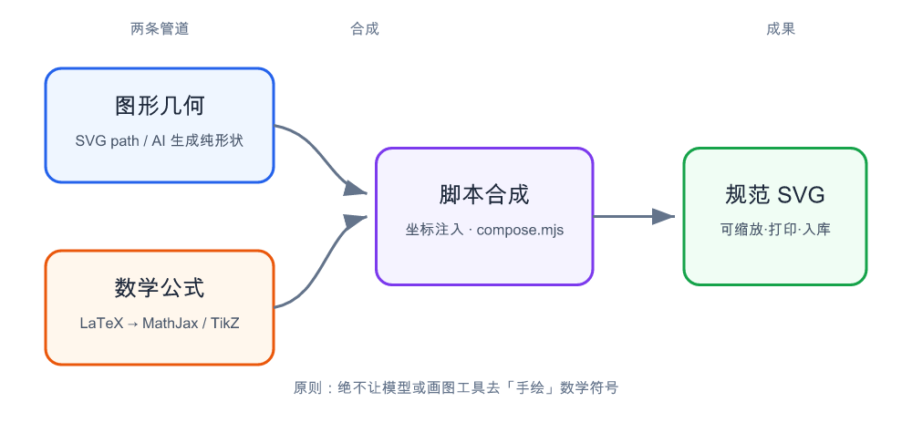
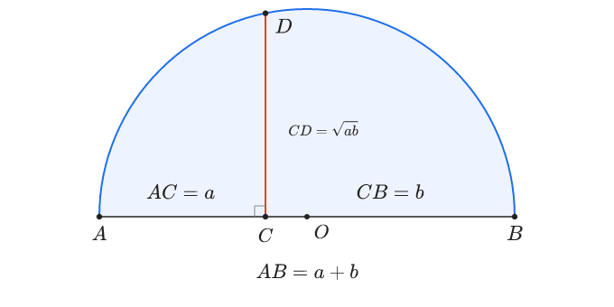
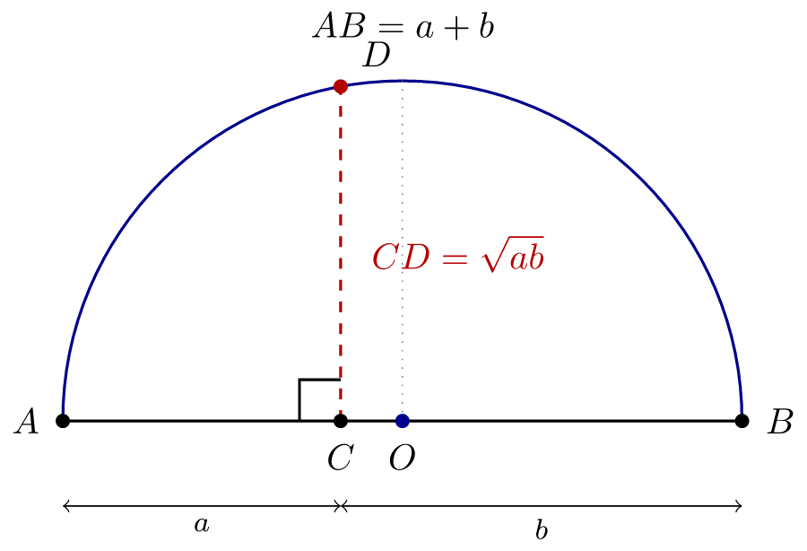

## 起因：一张配图引发的折腾

最近在给高考生做「不等式」章节的深度学习材料。其中有一段话需要配一张示意图——

> 在一条线段 $AB = a+b$ 上取分点 $C$，使 $AC = a,\ CB = b$；再以 $AB$ 为直径作半圆，过 $C$ 作 $AB$ 的垂线交半圆于 $D$，则 $CD = \sqrt{ab}$。

随手让 AI 出图，出来的构图、配色都挺像样，可定睛一看：**公式翻车了**——积分号、根号、上下标、极限位置全都被“描”得似是而非，放进讲义里根本没法用。

这其实是很多人做教学 / 技术配图时的共同痛点。于是我认真研究了一遍，结论很明确，也顺手沉淀成了一个可复用的工具。下面是完整的方法论。

## 一句话结论

**图形和数学必须「分两条管道生产、最后合成」，数学永远交给真正的排版引擎（TeX / MathJax / KaTeX），绝不让模型去“画”符号。**



如上图：图形几何（手绘 SVG 路径，或 AI 生成的纯形状）走一条管道；数学公式写成 LaTeX、交给引擎转成 SVG 路径，走另一条管道；最后用脚本把公式按坐标合成进图形。

## 为什么 AI 画公式会翻车

这不是“提示词没写好”。模型把数学符号当成**视觉纹理**去拟合，它没有“根号要包含整个被开方数”“分式线要水平居中”“极限的 $\lim$ 下标要压在右下”这类**排版语义**。这是一个架构层面的能力边界，调 prompt 解决不了，只能换引擎。

常见错误做法，逐一反驳：

- ❌ “换个 prompt 让 AI 仔细点” —— 无效，根因是语义缺失而非态度。
- ❌ “用 Unicode 数学字符写进 SVG `<text>`” —— 分式、根号、矩阵的版式给不了，跨字体还会乱。
- ❌ “让图像模型直接把公式画出来” —— 出来要么是模糊位图，要么仍是“画”的，符号照样错且不可编辑。

## 三条落地路径

| 路径 | 适合 | 数学质量 | 成本 |
|---|---|---|---|
| **TikZ + LaTeX** | 几何图（圆/三角/坐标/矩阵） | 最高，数学原生 | 重：需装 TeX |
| **MathJax 合成**（下例） | 已有 AI 图、只换公式标注 | 高 | 轻：Node + mathjax-full |
| **matplotlib 导出 SVG** | 函数图像 / 统计图 | 高（`usetex`） | 中：pip + 可选 LaTeX |

简单排序：**图形本身就是几何图 → 直接上 TikZ**（单一源码、零合成步骤）；**图形是 AI 画的示意图、只想换掉里面的公式 → 走 MathJax 合成**；**是函数图像 / 统计图 → matplotlib**。

## 路径 B 示例：MathJax 合成

图形手绘成 SVG 路径，公式交给 MathJax 转成 SVG 路径，脚本按坐标注入。下面这张就是按这个方法产出的同一道几何题配图：



核心代码（MathJax 把 LaTeX 变成干净的 SVG `<path>`，而不是让模型去描）：

```js
// tex2svg.mjs  (npm i mathjax-full)
import { mathjax } from 'mathjax-full/js/mathjax.js';
import { TeX } from 'mathjax-full/js/input/tex.js';
import { SVG } from 'mathjax-full/js/output/svg.js';
import { liteAdaptor } from 'mathjax-full/js/adaptors/liteAdaptor.js';
import { RegisterHTMLHandler } from 'mathjax-full/js/handlers/html.js';
import { AllPackages } from 'mathjax-full/js/input/tex/AllPackages.js';

const adaptor = liteAdaptor();
RegisterHTMLHandler(adaptor);
const tex = new TeX({ packages: AllPackages });
const svg = new SVG({ fontCache: 'local' });
const doc = mathjax.document('', { InputJax: tex, OutputJax: svg });
const node = doc.convert(String.raw`\int_0^1 x^2\,dx = \frac13`);
console.log(adaptor.outerHTML(node));   // 标准 SVG <path>，可按坐标 <use> 进图形
```

出来的 `∫`、`√`、上下标、分式线全是引擎排出来的，文件里**没有一个靠字体渲染的 `<text>`**。

## 路径 A 示例：TikZ（几何与数学同源）

如果图形本身就是几何 / 坐标类，最省心的做法是**几何和公式写在同一份 `.tex` 里**，TeX 同时排版两者，天然同源、永远对齐。下面这张是同一道题的另一条路径产出：



编译就一行（注意下面的关键坑）：

```bash
# 强制 pgf 使用原生 dvisvgm 驱动，导出 SVG 不再依赖 Ghostscript
printf '\\def\\pgfsysdriver{pgfsys-dvisvgm.def}\n' | cat - figure.tex > build.tex
latex build.tex && dvisvgm -n -o figure.svg build.dvi
```

> ⚠️ **踩坑**：默认 `latex` 走 dvips(PostScript) 驱动，`dvisvgm` 处理这些 special **依赖 Ghostscript 库**。没装或找不到 `libgs` 时，会报“几百个 PostScript specials ignored”，产物**只剩文字、几何全丢**，而且 SVG 尺寸缩到几十 pt，非常迷惑。强制 dvisvgm 原生驱动即可彻底绕开。

## 关键踩坑清单（复用必读）

1. MathJax 输出包着一层 `<mjx-container>` HTML 标签，嵌进 SVG 前必须剥掉只留 `<svg>`。
2. MathJax SVG 的宽高单位是 **ex 不是 pt**；尺寸从 `viewBox` 反推，再靠外层 `scale()` 控制字号。
3. 多个公式嵌进同一文档会撞 glyph id（`MJX-1-...`），逐个加唯一前缀。
4. `currentColor` 换成显式颜色，部分渲染器才可靠。
5. SVG 上凸半圆弧：从左端点到右端点用 `sweep-flag=1`。
6. TikZ→SVG：见上，别走默认 PostScript 路线，强制 dvisvgm 驱动。

## 做成开源 skill 了

把整套方法和工具封装成了 skill **`math-figure-svg`**，已推到公开仓库，任何人 `npm install` 就能用：

- 方法论文档 `SKILL.md`
- 工具 `compose.mjs`：`--geom geometry.svg --labels labels.json --out out.svg [--png]`
- 两个可跑示例（MathJax 合成 / TikZ 同源）

仓库地址：<https://github.com/na57/skills/tree/main/math-figure-svg>

## 一句话总结

**数学不是“画”出来的，是“排版”出来的。** 图形与数学分管道、公式交给引擎、脚本合成——规范性和缩放清晰度都不再是问题。
